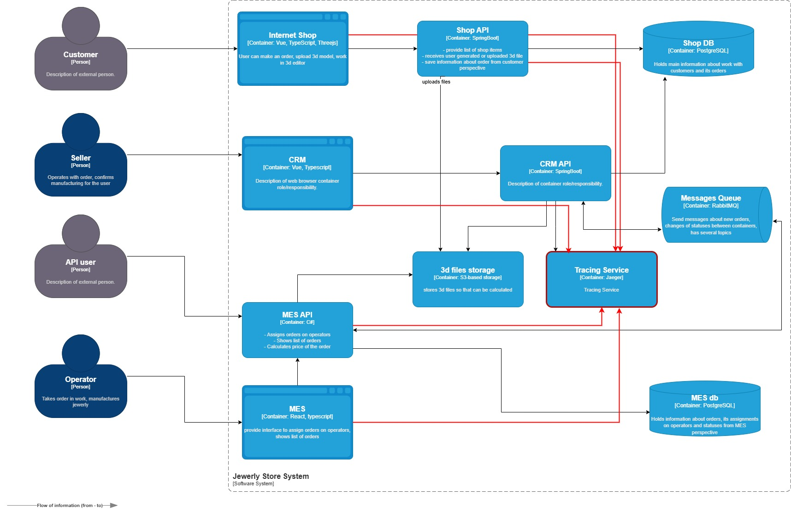

## Процесс обработки заказа:

- Shop API (или через CRM API) -> MES API - передача первичной информации о заказе (через Rabbit MQ)
- MES API - расчет стоимости заказа
- MES API -> CRM - передача рассчитанной стоимости для подтверждения заказа (Rabbit MQ)
- CRM -> MES API - передача подтверждения для готовности обработки операторами
- MES API - Изменение статуса заказа в соответствии с этапом производства

Во всех этих местах заказ может сломаться или зависнуть.
Таким образом элементы системы, которые следуют покрыть трейсингом:

- Shop API
- CRM
- MES

Сервисы также будут пробрасывать контексты в заголовки сообщений в RabbitMQ, таким образом можно будет отследить весь
жизненный цикл заказа

Для трейсинга следует предусмотреть следующие метаданные, распространяемые по всей цепочки используемых сервисов

- trace_id - Сквозной идентификатор трейсинга на весь жизненный цикл заказа
- order_id - Уникальный идентификатор заказа
- user_id - Идентификатор клиента/партнёра
- source - Кто инициировал заказ (shop, MES API)
- error_message - Сообщение об ошибке (если была ошибка)
- timestamp - время начала каждого span  
  Для каждого span будет производиться расчет длительности

## Мотивация

На текущий момент в системе «Александрит» отсутствует возможность сквозного отслеживания жизненного цикла заказа — от
момента создания клиентом до отгрузки.
Заказ проходит через несколько систем (Shop, CRM, RabbitMQ, MES), и если на каком-либо этапе происходит сбой или
задержка, невозможно быстро и надёжно определить, что именно пошло не так.

**К чему это может привести**:

- Поддержка не может оперативно ответить, на каком этапе «завис» конкретный заказ.
- Разработчики тратят много времени, чтобы вручную собрать цепочку событий из логов. При этом поиск состояния заказа
  начинается в основном уже после явных жалоб заказчиков
- Нехватка логов может сделать вовсе поиск места "подвисания" невозможным. С другой стороны большое количество логов
  уровня debug может только забить хранилище логов огромным количеством данных и привести к лишним издержкам
- Увеличивается количество жалоб, компания теряет конкурентоспособность и авторитет
- Отсутствует оперативность реагирования на инциденты
- Нет картины по длительности и качеству обработки на каждом этапе, что усложняет планирование бизнеса и внедрение
  улучшений
- Невозможно определить "виновных"

**Что даёт внедрение трейсинга**:

- Возможность в реальном времени видеть путь каждого заказа по сервисам и понять, где он находится.
- Быстрое обнаружение проблем с потерей сообщений или зависаниями статусов, возможность быстро исправить ситуацию
- Анализ времени обработки на каждом этапе — от создания до производства.
- Поддержка может грамотно объяснить клиенту, в каком статусе его заказ находится, снижается количество жалоб
- Большая часть "подвисаний" не требует анализировать логи всей системы. У разработчиков появляется время на выполнение
  более важных задач

**Внедрение трейсинга повлияет на такие метрики как**:

- Mean time to detect (MTTD) - Команда быстрее обнаруживает, что заказ «завис» или где произошёл сбой
- Mean time to resolve (MTTR) - Разработчики быстрее находят причину и исправляют проблему
- Точность диагностики инцидентов - четко виден сервис и компонент, в котором произошел сбой
- CPU, Latency - для хранилища логов с элементами поиска вслдствие уменьшения их количества
- DAU - число пользователей в день, показывает уровень доверия
- Retention - возвращаемость пользователей
- Процент заказов, завершённых вовремя
- Скорость ответа поддержки клиенту

## Предлагаемое решение

Подход и технология

1. `OpenTelemetry`  
   Для стандарта обмена данными трейсинга предлагается использовать OpenTelemetry.
   OpenTelemetry - стандартизированный и гибкий инструмент, поддерживаемый многими языками и фреймворками.
   С его помощью можно безболезненно распространять контекст со статической и динамической информацией в пределах
   распределенной системы, какой Александрит и является.
   OpenTelemetry sdk поддерживается языками Java и C#, на которых реализованы сервисы системы

2. `Jaeger`  
   Jaeger выбран вследствие его преимуществ:

- это официально поддерживаемый бэкенд для OpenTelemetry
- Удобная визуализация жизненного цикла запроса с возможностью поиска по тэгам
- возможность отображать передачу контекста в AMQP
- Легкий деплой и эксплуатация
- есть механизм Span Link

**Что нужно внедрить**:

- добавить OpenTelemetry SDK в каждый из сервисов: Shop API, CRM API, MES API, настроить TraceProvider для работы с
  Jaeger
- настроить распространение контекста в коде приложений через HTTP и AMQP заголовки (метаданные для контекста указаны
  выше).   
  Основная часть трейсинга - будет проходить через сервисы по AMQP. Http запросы на обновление статуса заказа будут
  создавать спаны с метаданными order_id. Это позволит отследить все трейсы, связанные с заказом
- развернуть ElasticSearch для хранения данных, Jaeger Collector, Jaeger Query, Jaeger UI. Настроить цепочку передачи
  данных от коллектора до UI  
  В результате выполнения этого пункта будет настроен весь пайплайн от обработки телеметрии и их хранению до запросов и
  отображению в удобном для пользователю формате

[Диаграмма для сбора данных трейсинга](jewelry_with_tracing.drawio)

## Компромиссы

- Интеграция OpenTelemetry в кодовые базы (например, CRM и MES API), может быть сложной. 
Разработчик который умеет работать с OpenTelemetry, если неоптимальгный код, то на интеграцию уйдет больше времени 
Чтобы решить эту проблему, можно нанять программиста на C#.

- Необходимо будет изменить код в сервисах, чтобы добавить поддержку OpenTelemetry. Это может потребовать
  значительных усилий, особенно если код не был написан с учетом расширяемости и поддержки.

- Нужно добавить order_id в метаданные span контекста. Если у MES сервиса нет общего id, то получатся фрагментированные трейсы.

- При большом трафике и множестве span’ов (например, если трассируем все PATCH-запросы) объем данных может стать огромным. 
Это займет место, потребует обработки и индексирования. Если используем Elasticsearch, то могут возникнуть дополнительные 
расходы на хранение данных и масштабирование. Если система начнет тормозить из-за обработки большого количества данных, то польза от трейсинга уменьшится.

- Если исходный код CRM недоступен, то придется использовать прокси-серверы. Возможно, временно придется обойтись без 
данных от CRM и связывать все подзапросы к одному заказу, чтобы сэкономить.

- В случае отсутствия опыта работы с tracing-инфраструктурой (OpenTelemetry, Jaeger ), то есть риск, что инструмент установят, но никто им не будет пользоваться. Нужно обучать сотрудников, иначе внедрение инструмента будет бесполезным.

## Аспекты безопасности

1. Аутентификация 2FA или Wauthn и авторизация по необходимым ролям - доступ получают только сотрудники с определенными ролями: Разработчик, Поддержка,
   DevOps, SRE Инженер, QA, Product Owner.
2. Шифрование трафика (TLS)  
   Все соединения между API-сервисами и OpenTelemetry Collector, Collector и Jaeger storage, пользователями и Jaeger UI
   должны быть защищены TLS (HTTPS/gRPC over TLS).
3. Базовый аудит и логирование действий пользователей. Вся активность пользователей проверяется с целью предотвратить
   несанкционированные действия
4. Разделение окружений (dev / stage / prod) - чтобы не смешивать данные и предотвратить их повреждение
5. Защита от DDoS-атак - использование WAF (Web Application Firewall) для защиты от DDoS-атак и других угроз.
6. Защита от SQL-инъекций - использование ORM (Object-Relational Mapping) для защиты от SQL-инъекций и других атак на базу данных.
7. Защита от XSS-атак - использование Content Security Policy (CSP) для защиты от XSS-атак и других угроз безопасности.
8. Защита от CSRF-атак - использование CSRF-токенов для защиты от CSRF-атак и других угроз безопасности.
9. Инструменты для управления инцидентами - использование инструментов для управления инцидентами и реагирования на инциденты, таких как SIEM (Security Information and Event Management) и SOAR (Security Orchestration, Automation, and Response).
10. Обучение сотрудников - обучение сотрудников основам безопасности и защите данных, чтобы предотвратить утечки данных и другие инциденты безопасности.

