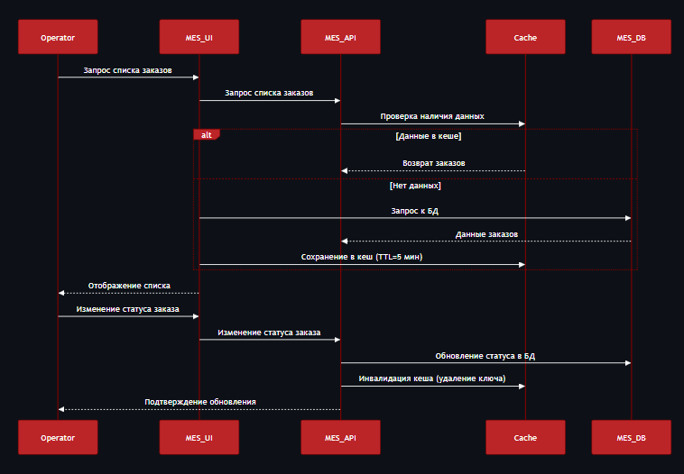
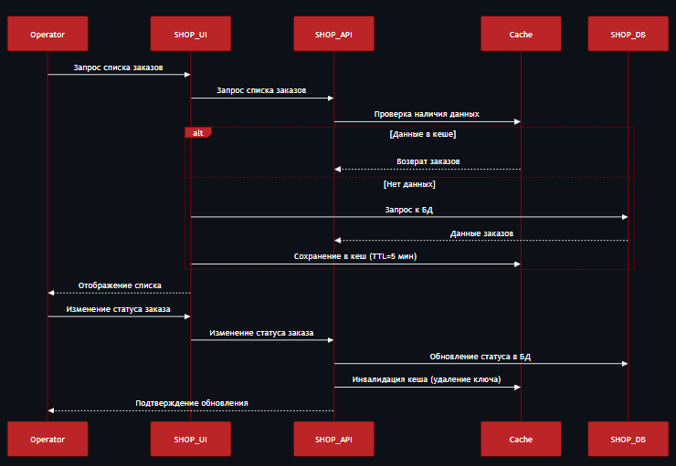

## Архитектурное решение по кешированию  

## 1. Мотивация  
Проблемы:  
- Низкая скорость MES: сотрудники испытывают задержки при загрузке страниц с заказами.
- Низкая скорость интернет-магазина: сотрудники сталкиваются с задержками при загрузке страниц с заказами.
- Долгое выполнение заказов: клиенты недовольны временем обработки заявок.
- Высокая нагрузка на базу данных MES: частые запросы к PostgreSQL замедляют систему.
- Высокая нагрузка на базу данных SHOP: частые запросы к PostgreSQL замедляют систему.
 
Цели кеширования:

- Ускорить работу с часто запрашиваемыми данными, например, со списком заказов.
- Снизить нагрузку на базу данных.
- Улучшить отзывчивость интерфейса для сотрудников.

Элементы для кеширования:

- Список заказов.
- Информация о текущем производственном статусе.
- Результаты расчетов стоимости.

---

## 2. Предлагаемое решение  
Для снижения нагрузки на MES используем серверное кеширование через Redis, что централизованно управляет данными
 и уменьшает задержку для всех пользователей. Клиентское кеширование не решает проблему.

Паттерн: Lazy Loading (Cache-Aside).

Преимущества:

1. Простота: данные загружаются в кеш только при первом запросе.
2. Гибкость: легко инвалидировать кеш при изменениях данных.
3. Эффективность: снижает нагрузку на базу данных, не требуя синхронной записи в кеш.

## 3. Сравнительный анализ стратегий инвалидации кеша  
| Критерий       | Cache-Aside       | Read-Through      | Write-Through     | Write-Behind      | Refresh-Ahead     |  
|--------------------|-----------------------|-----------------------|-----------------------|-----------------------|-----------------------|  
| Консистентность | Низкая (риск расхождений) | Средняя (зависит от реализации) | Высокая (синхронная запись) | Средняя (асинхронная запись) | Средняя (зависит от частоты обновлений) |  
| Производительность | Средняя (кеш-промахи) | Средняя (кеш-промахи) | Низкая (задержки записи) | Высокая (асинхронность) | Высокая (предзагрузка) |  
| Сложность      | Низкая               | Средняя               | Высокая              | Высокая              | Очень высокая        |  

Cache-Aside на Redis — оптимальный выбор, так как:  
1. Уменьшает нагрузку на БД.  
2. Прост в реализации.  
3. Позволяет гибко управлять инвалидацией.  

Альтернативные паттерны:
1. Read-Through: требует постоянного обновления кеша, что увеличивает нагрузку на систему.
2. Write-Through: перегружает кеш при частом обновлении данных, снижая производительность.
3. Refresh-Ahead: избыточен, так как не все данные требуют предварительного обновления, увеличивая нагрузку на систему.
4. Write-Behind: сложен в реализации и требует дополнительной логики для обработки ошибок.

## 4. Диаграммы последовательности
## Диаграмма последовательности запроса списка заказов для MES

## Диаграмма последовательности запроса списка заказов пользователя интернет магазина  

## 5. Стратегия инвалидации кеша
Инвалидация по ключу + TTL (временная)
- По ключу: При изменении статуса заказа удаляется соответствующий ключ (например, `orders:{order_id}`).  
- TTL (5 минут): Автоматическая очистка устаревших данных, если инвалидация не сработала.  

Обоснование  
- Только TTL: Риск отображения устаревших данных при редких обновлениях.  
- Полная инвалидация (например, при любом изменении): Слишком агрессивна, увеличивает нагрузку.  

## 6. Дополнительные рекомендации  
- Мониторинг кеша: Настроить алерты при высокой частоте промахов (cache miss).  
- Шардирование Redis: Для масштабируемости при росте заказов.  
- Асинхронная инвалидация: Чтобы не блокировать UI при обновлении статусов.

Redis Cache-Aside улучшает работу MES и интернет-магазина, снижая нагрузку на PostgreSQL. 
Это повышает качество обслуживания сотрудников и клиентов.